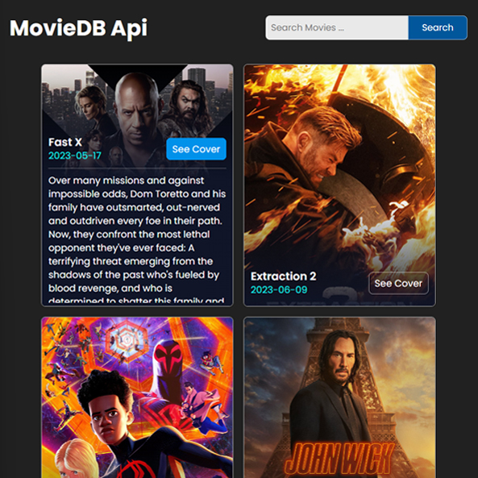

# Movie App (TheMovieDB)
Developed a movie search application using JavaScript, HTML, and CSS, which allows users to search for movies, view detailed information, and browse through movie lists. Integrated external APIs to fetch real-time data on movies, including ratings, release dates, and descriptions. Implemented dynamic features such as search filters and responsive design for a seamless user experience across devices.

# Screenshot
Here we have project screenshot :

